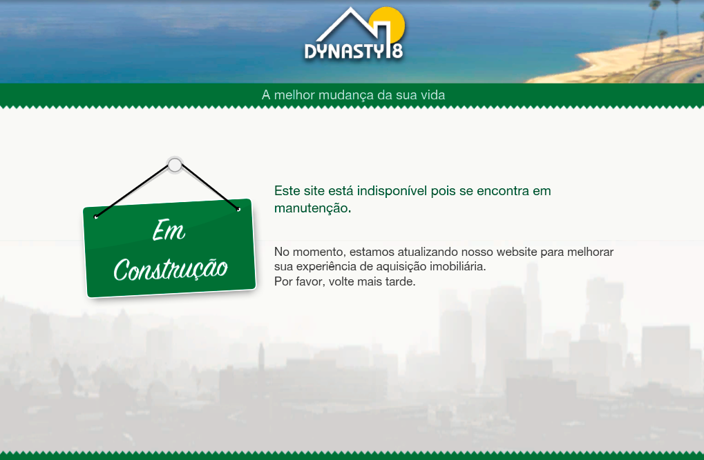

# Dynasty 8

Esse teste verifica o nivel de aprendizado sobre html e css, e deve ser resolvido de forma vanilla sem o uso de frameworks ou ferramentas como bootstrap e jquery;

## Avaliação

O que está sendo avaliado neste teste é o alinhamento do layout e a qualidade do código. As imagens utilizadas para a conclusão não são importantes.