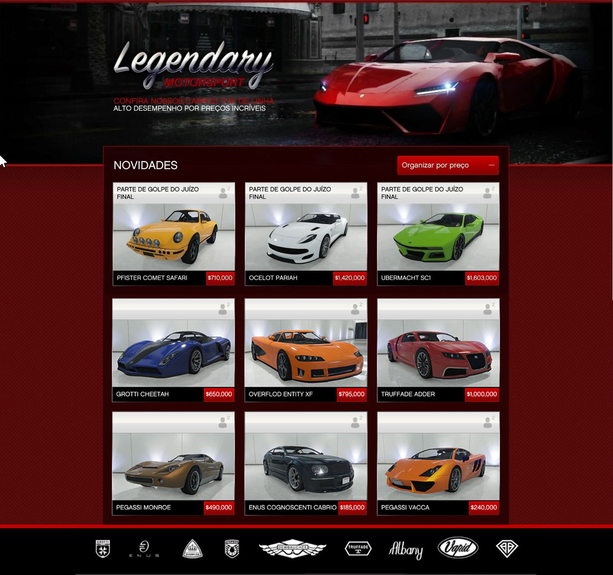

# Legendary Motor Sport

Esse teste verifica o nível de aprendizado de html, css e bootstrap. O bootstrap deve ser utilizado como base, css extra pode ser usado apenas para estilização e alinhamentos onde o bootstrap não oferece alternativas;

## Avaliação

O que está sendo avaliado neste teste é o alinhamento do layout e a qualidade do código. As imagens utilizadas para a conclusão não são importantes.